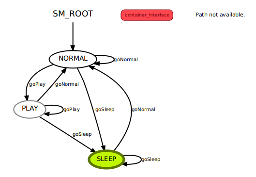
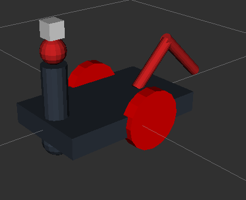

# Experimental Robotics Laboratory - Assignment 2
## Riccardo Lastrico - 4070551

### Assignment contents 

The assignment content is an exercise based on ROS about a finite state machine that represent a pet-like robot behavior; this robot moves in a 3D simulation using Gazebo and is equipped with an RGB camera. Using that camera, is able to recognize a ball that moves around in the environment, following the user's commands.

### System architecture

This is a graph of the system architecture (obtained via rqt-graph):

#####  Implemented nodes

The node <code>state_miro</code> contains the state machine that will be described right after this paragraph.
The node <code>cmd_generator</code> sends commands to the ball's action server (<code>reaching_goal</code>) and moves it in the space or makes it disappear; the commands could be sent by the user or could be random.
The node <code>image_feature</code> receives the image from the camera and if detects a ball sends a message to the <code>state_miro</node>; when the state machine will change state, this node will also send <code>cmd_vel</code> messages to the robot depending on the distance from the ball.
The node <code>reaching_goal2</code> is the robot action server.
### System states

This is a graph of the possible states (obtained via smach-viewer):

The possible states are: `sad`
<ul>
<li><code>SLEEP</code>, the robot is sleeping and so it wont respond to any command. After a while in any other state, even if not commanded to do so, it reaches location [-6,-6]. After some amount of time, the robot goes again in state NORMAL .</li>
<li><code>NORMAL</code>, the robot is in the predefined state, it moves randomly around the map until he detects the ball in his lane of sight: the robot will than pass to the <code>PLAY</code> state. </li>

<li><code>PLAY</code>, the robot enters in this state from the <code>NORMAL</code> one after seeing the ball: it chases it until it stops moving, than moves his head 45° to the left and to the right, then it continues staring the ball until it moves. If the ball disappears, the robot will go back to the <code>NORMAL</code> state.

</li>
></ul>

#####  Packages and file list

The only package that is present is <code>exp_assignment2</code>, which contains all the executable files.
In particular, we have:

 - `src` folder:
	 
	 - `moveclient.cpp`: contains the code to rotate the robot neck of a certain angle;

 - `scripts` folder:
	 - `state_machine_miro_ext.py`: is the state machine of the robot;
	 - `ball_c.py` and `ball_c_random.py` that are responsible for the generation of the command for the ball, the first program recevies input from the user and the second generates them randomly, the node is called `cmd_generator`.
     - `go_to_point_action.py`: contains the code for the action server of the robot, reads 

### Installation 

This is a ROS package, so it will be necessary to clone this repository into the <code>src</code> folder of a ROS workspace (here is assumed to be named <code>my_ros</code>):
    
	
    cd ~/my_ros/src
    git clone
    catkin_make --pkg exp_assignment2

    
Some packages are needed:
    smach-viewer
    cv_bridge
    actionlib
    actionlib_msgs
    image_transport

### Run the simulation 

To easily run the simulation i created a launch file, that can be used this way:

    
    source ~/my_ros/devel/setup.bash 
    roslaunch exp_assignment2 gazebo_world2_random.launch

This runs the random simulation, the state of the robot and its position in the space will be outputted on the shell with the information about the command received and an eventual change of state.

If you want to interact with the simulation by givin commands you have to run:
    
    source ~/my_ros/devel/setup.bash 
    roslaunch exp_assignment2 gazebo_world2.launch

and then open a new shell and run:

    source ~/my_ros/devel/setup.bash 
    rosrun exp_assignment2 ball_c.py 
A command line interface willconsent to send commands to move the ball or make it disappear.

For both, an additional window will open: this contains the output image from the robot's camera.

### System features 

The system features a finite-state machine using the <code>Smach</code> packet and a simulation done via Gazebo: the robot contains a "navigation by following" appproach, using "color blob recognition" to recognize a green ball in the image provied by the camera; the robot itself features the camera, two actuated joints (the wheels) and an additional one, the neck, that can be moved around the roll axis. 
The system also features the possibility to be controlled by the user or behave fully randomly.

This is the robot:

### System limitation

Sometimes the ball movement makes the robot "roll" on itself and goes into a position where it cannot moved anymore and have to be "flipped" manually from the user.

### Possible improvements

### Documentation

The documentation is accessible in:

    ./doc/html/index.html

### Contacts

Riccardo Lastrico - 4070551

Email: riky.lastrico@gmail.com

